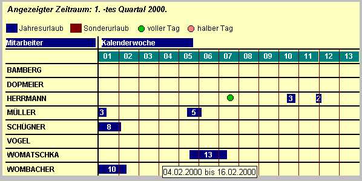



## TimeChart\_ado\.ocx

### Description

Mit TimeChart_ado.ocx können Zeiträume von, zB. Urlaubplänen oder Projektplanungen, grafisch dargestellt werden. Dabei werden die relevanten Infos aus deiner individuellen Datenbank ausgelesen.

NEU: Im Gegensatz zur DAO Version (TimeChart.ocx) nutzt dieses Ding nun ADO 2.1 und kann damit an jede datenbank gehangen werden, die ADO unterstützt!
 
### More Info
 
Enthalten ist der gesamte Quellecode (dokumentiert) und ein komplettes Beispiel (dokumentiert)

Ach ja:

Das OCX ist ebenfalls FREEWARE für den privaten Gebrauch.

             |
---                |---
**Submitted On**   |2000-07-24 13:07:28
**By**             |[Axel Womatschka](https://github.com/Planet-Source-Code/PSCIndex/blob/master/ByAuthor/axel-womatschka.md)
**Level**          |Advanced
**User Rating**    |5.0 (10 globes from 2 users)
**Compatibility**  |VB 6\.0
**Category**       |[Custom Controls/ Forms/  Menus](https://github.com/Planet-Source-Code/PSCIndex/blob/master/ByCategory/custom-controls-forms-menus__1-4.md)
**World**          |[Visual Basic](https://github.com/Planet-Source-Code/PSCIndex/blob/master/ByWorld/visual-basic.md)
**Archive File**   |[CODE\_UPLOAD80827242000\.zip](https://github.com/Planet-Source-Code/axel-womatschka-timechart-ado-ocx__1-10008/archive/master.zip)

